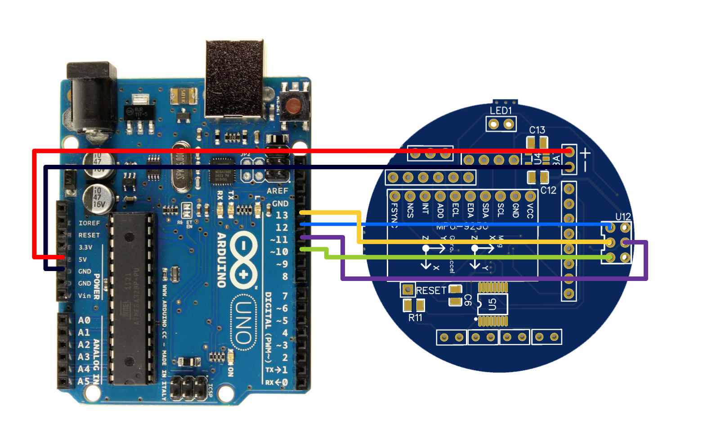

 
 If you're using the custom boards you'll need to flash a custom bootloader that lets you use the internal 8Mhz oscillator as a clock signal. I recommend using [MiniCore][MiniCore], instructions on how to add it to your arduino IDE are right [here][installMiniCore].

# Bootloader minimum component requirement
After soldering these components you'll be ready to flash the bootloader:
| Left Board | Right Board |Value|
| ------ | ------ |------|
|U3|U9|Atmega328p
|R12|R11|10kΩ
|U10|U4|3.3v LDO
|C19|C12|1uF
|C20|C13|1uF

 - Reminder: you can get the LDO regulator off of your MPU9250 since we're not going to be using it anyways.

# Bootloader Installation

The easiest way to flash the bootloader is using an Arduino as ISP. Connect the board like shown in the picture:

Upload the Arduino as ISP sketch to the Arduino, under the tools menu, click boards, select Minicore and then use the following settings:

| Setting | Value |
| ------ | ------ |
|Board|Atmega328|
|Clock|Internal 8Mhz|
|BOD|2.7V|
|EEPROM|EEPROM Retained|
|LTO|LTO Disabled|
|Variant|328P/328PA|
|Bootloader|Yes(UART0)|

After selecting these settings, under tools, select "Burn Bootloader" the Led's on your arduino should flash a couple times and if all goes well you should see the message "done burning bootloader" at the bottom of the IDE.

After burning the bootloader you can upload the firmware either using the current setup with the Arduino as ISP, or you can hook up an FTDI programmer to the debug port and the reset line and program it through serial.

   [MiniCore]: <https://github.com/MCUdude/MiniCore>
   [installMiniCore]: <https://github.com/MCUdude/MiniCore#how-to-install>