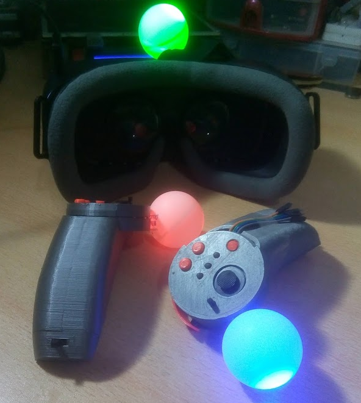

Hice un servidor de Discord para soporte, updates y preguntas, aunque por ahora está bastante vacío. 

# HadesVR       
HadesVR es un setup de realidad virtual compatible con SteamVR. 

Este conjunto incluye controles que puedes crear tu mismo que son capaces de emular los controles "Wand" del HTC Vive o la mayoría de los aspectos de los controles "Knuckles" del Valve Index (incluyendo el trackeo de los dedos de tu mano). También incluye la electronica necesaria para hacer el trackeo de un Visor de realidad virtual con su respectivo receptor de radiofrecuencias para recibir la información de ambos controles. 

También hay hardware de personalizado como carcasas para imprimir en 3D con sus respectivos PCB para armar tus propios controles de estilo "Knuckles" y "Wand". (en este momento, los controles Knuckles estan por ser rediseñados por lo que no recomiendo hacerlos ahora mismo)

El driver de SteamVR solía estar basado en [TrueOpenVR](https://github.com/TrueOpenVR) Pero ha sido modificado tanto que decidí convertirlo en un proyecto a parte.
El driver también utiliza [PSMoveServiceEx](https://github.com/Timocop/PSMoveServiceEx) (al menos por ahora) para el tracking de la posición del visor y ambos controles en un espacio 3D.

Para mas información en todo, recomiendo leer la [documentación.](docs/DocsIndex.md)!

# Cómo funciona y que es lo que puede hacer?

El visor se conecta al PC y envía la rotación del mismo, además de recibir la informacion de ambos controles, tanto rotación como el estado de los botones/joysticks. Al mismo tiempo el tracking 3D es realizado con camaras colocadas en la habitación utilizando [PSMoveService](https://github.com/psmoveservice/PSMoveService).

Las configuraciones soportadas son: 
* Visor y controles: El visor recibe la información de los controles y al mezclarla con la información de PSMoveService se consigue una experiencia de realidad virtual con 6 grados de libertad (rotación y posición)
* Solo visor: Donde solo tienes el visor, se puede tener una experiencia tanto de 6 grados de libertad como de 3 grados de libertad, si se decide no utilizar PSMoveService.
* Solo controles: Donde ya tienes un visor y utilizas los controles de HadesVR. para esto deberás utilizar un [Receptor RF](docs/RFReceiver.md) para reemplazar el rol de recibir los datos del que se encargaba el visor.

## Lo que puede y lo que no puede hacer:
* Este driver puede emular controles tipo Wand y tipo Knuckles.
* Este driver *no* puede hacer tracking "Inside-Out".
* Este driver *no* puede hacer Full body tracking ~~**aún**~~.
* Si, se puede jugar Beatsaber pero no sé que tan viable sea para altas dificultades.

# Hardware custom

En este momento, todo el hardware custom que hay disponible es:

### ⚠️Tanto el Basic HMD como los Wand controllers carecen de las partes imprimibles en 3D por ahora.
* [HadesVR Basic HMD PCB](https://github.com/HadesVR/Basic-HMD-PCB) 
* [HadesVR Wand Controllers](https://github.com/HadesVR/Wand-Controller)

### ⚠️IMPORTANTE: los controles de tipo Knuckles están a punto de ser rediseñados, tanto los modelos 3d para imprimir como las placas PCB para hacerlos mas faciles de armar. recomiendo muy muy fuertemente no fabricarlos hasta que haya terminado con el rediseño ya que en el estado que esta ahora mismo tiene varios problemas, una vez dicho esto:

O quizás quieres crearlos tu mismo, recomiendo leer la [Documentación de los controles](docs/DocsIndex.md#controllers) donde se explica como crear tus propios controles con placas Arduino.

# Demos

Trackeo de dedos!

Demo de beatsaber:

Half-Life: Alyx:

# Trello
[Trello para las cosas de HadesVR](https://trello.com/b/4Ogw6SMk/hadesvr-stuff)