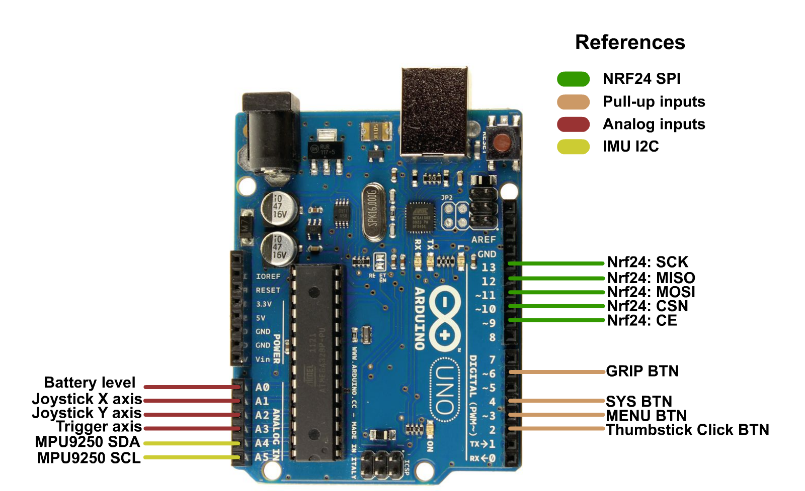
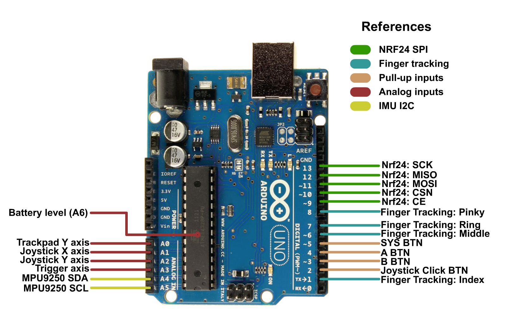

# Controllers

This doc talks about designing your own DIY controllers, if you want to see the custom ones (with the custom pcbs and 3d printable parts) you should check out the [Custom Hardware]() list.

HadesVR supports two kinds of controllers as of right now: Wand-like controllers and Knuckles-like controllers with all of their supported inputs respectively.
Controllers connect through RF, directly to the Headset which then sends the received controller data over to the PC, both controllers require similar hardware with some minor differences:

# Wand Controllers:

These controllers aim to simulate the original Vive wand controllers, they're easier to build option to the Knuckles ones but they're lacking the finger tracking aspect.
These controllers support analog trigger though it's not enabled by default, to allow for it you just need to change a couple lines of code. They also have battery % monitoring but you need to calibrate that on your own and tends to not be super accurate.

## Hardware needed per controller is as follows:
| Component | Purpose | Notes | Amount |
| --------- | ----------- | ----- | ------ |
| Arduino Nano/UNO/Pro Mini* | The brains of the controller | keep in mind you'll need a serial programmer if you're using a Pro Mini | 1 |
| MPU9250*   | Used to gather rotation data | Orientation of the IMU matters so keep that in mind. | 1 | 
| NRF24L01  | Used to transmit the controller data over to the HMD | You *will* need a 3.3v regulator if you're using a Pro Mini | 1 | 
| 5mm Red or Blue LED | Used for 6dof tracking | Each controller/headset has to have a different color: For example Green HMD, Red Left controller, Blue Right controller. | 1 |
| Tact switches | You'll be using these as your Trigger, grip, menu and system buttons | You can use Rubber dome switches, those are a lot more comfortable than the hard plastic ones. | 4 |
| Resistor for the LED | Used to limit the current for the tracking LED | It's value depends on the color of the LED and the voltage you're using. | 1 |
| Any lithium battery | Will power the controller so I recommend 18650s | avoid Ultrafire batteries at all cost they lie about their capacity. | 1 |
| TP4056 Battery charger with protection | Is in charge of charging and protecting your battery | Remember to set the charging current to 0.5c to be safe. | 1 |
| 5v step up converter | To power the Arduino | Needed unless you've got a 3.3v arduino, then you'll need a 3.3v ldo regulator like the HT7533 or MCP1700-3.3| 1 |
| ON-OFf Switch | To turn on or off the controllers | Goes between the output positive of the tp4056 board and the step up converter/regulator.| 1 |
| Analog stick module with button | Your main Analog stick | any will do really, if yours doesn't have a button you'll need an extra tact switch to simulate trackpad click. | 1 |
| White ping pong ball | Used to difuse the LED's light for 6dof tracking | Any will do as long as it's white and 40mm in diameter | 1 |

*can use any (preferrably) 9dof IMU but you'll need to modify the code a bit to allow for that.

## Controller pinouts are the following:

Battery level monitoring is done using a 1k-3.3k resistor divider if you're using a 3.3v arduino. If you're using a 5v arduino with a step up converter you can connect the battery + terminal directly to the A0 analog pin.
A0 can also be left floating if battery level monitoring is not desired.

Digital pins all have internal pull up resistors programmed so all you have to do is put the switch between the pin and GND.

# Knuckles Controllers

Made to simulate the Valve Index knuckles' controllers, with full support for finger tracking with a bit of a harder build.
These also support analog triggers though it is disabld by default.
Also supported is analog finger curl, also disabled by default since you'd need a microcontroller with 12 or more analog inputs to be able to detect the curl of each finger.

Hardware is mostly similar to the Wand controllers with the adition of 3 buttons to detect the status of the middle, ring and pinky finger. These buttons can be replaced by a TTP224 touch sensor for capacitive sensing of the fingers.

You might notice a lack of a grip button, it's not needed since we can get the grip status and strength from the middle,ring and pinky buttons: middle finger only: 50% grip strenth, middle and ring = 75% strength, middle ring and pinky: 100% strength.

## Hardware needed per controller is as follows:
| Component | Purpose | Notes | Amount |
| --------- | ----------- | ----- | ------ |
| Arduino Nano/UNO/Pro Mini* | The brains of the controller | keep in mind you'll need a serial programmer if you're using a Pro Mini | 1 |
| MPU9250*   | Used to gather rotation data | Orientation of the IMU matters so keep that in mind. | 1 | 
| NRF24L01  | Used to transmit the controller data over to the HMD | You *will* need a 3.3v regulator if you're using a Pro Mini | 1 | 
| 5mm Red or Blue LED | Used for 6dof tracking | Each controller/headset has to have a different color: For example Green HMD, Red Left controller, Blue Right controller. | 1 |
| Tact switches | You'll be using these as your Trigger, system, A, B, Trackpad and finger sensing buttons | You can use Rubber dome switches, those are a lot more comfortable than the hard plastic ones. | 10 |
| Resistors for the trackpad resistor network | to convert the status of 3 switches into an analog value | 2x1k, 2x10k 1x3.3k | 5 |
| Resistor for the LED | Used to limit the current for the tracking LED | It's value depends on the color of the LED and the voltage you're using. | 1 |
| Any lithium battery | Will power the controller so I recommend 18650s | avoid Ultrafire batteries at all cost they lie about their capacity. | 1 |
| TP4056 Battery charger with protection | Is in charge of charging and protecting your battery | Remember to set the charging current to 0.5c to be safe. | 1 |
| 5v step up converter | To power the Arduino | Needed unless you've got a 3.3v arduino, then you'll need a 3.3v ldo regulator like the HT7533 or MCP1700-3.3| 1 |
| ON-OFf Switch | To turn on or off the controllers | Goes between the output positive of the tp4056 board and the step up converter/regulator.| 1 |
| Analog stick module with button | Your main Analog stick | any will do really, if yours doesn't have a button you'll need an extra tact switch to simulate trackpad click. | 1 |
| White ping pong ball | Used to difuse the LED's light for 6dof tracking | Any will do as long as it's white and 40mm in diameter | 1 |

*can use any (preferrably) 9dof IMU but you'll need to modify the code a bit to allow for that.

## Controller pinouts are the following:

Battery level monitoring is done using a 1k-3.3k resistor divider if you're using a 3.3v arduino. If you're using a 5v arduino with a step up converter you can connect the battery + terminal directly to the A0 analog pin.
A0 can also be left floating if battery level monitoring is not desired.

Digital pins all have internal pull up resistors programmed so all you have to do is put the switch between the pin and GND.

# Calibration
For all controllers you'll need to calibrate:
* The joystick maximums, minimums and deadzones
* The battery level
* The IMU's magnetometer
* In the case of the index controller the trackpad position.
