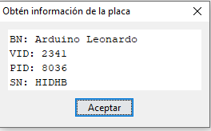
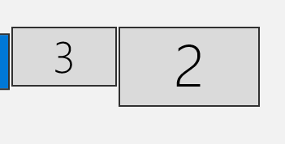

# Driver

# Driver Installation
Driver installation is quite simple, the steps are as follows:
* Download the latest release of the driver from the [Releases Page](https://github.com/HadesVR/HadesVR/releases)
* Unzip the driver into your Steam\steamapps\common\SteamVR\drivers folder.
* Configure the driver

Assuming you have already followed the steps in the [Tracking](Tracking.md) doc, you should have PSMoveService already installed in your PC.

If you don't plan on making a 6dof headset (a 3dof headset for Sim racing, etc), you can skip the PSMoveService related steps.

# Driver Configuration

Driver configuration is pretty self explanatory, the driver configuration file is stored in hadesvr\resources\settings\default.vrsettings. To change the settings just open the file with the text editor of your liking.

If you're planning to use different drivers at the same time (HadesVR controllers with TOVR HMD for example), you'll also need to enable the `activateMultipleDrivers` setting in the Steam\config\steamvr.vrsettings file. 

The driver configuration is divided into a couple sections for tidyness, these are the following:

### "Driver" section where you'll find:
|Parameter|Type    |Description|
| ------  | ------ |------     |
| HID_VID | int | The VID value of your HID device, in decimal numbers. |
| HID_PID | int | The PID value of your HID device, in decimal numbers. |

### "Display" section where you'll find:
|Parameter|Type    |Description|
| ------  | ------ |------     |
| Stereo  | bool | Enables or disables Stereo display mode, keep enabled unless you're a cyclops.     |
| IsDisplayOnDesktop  | bool | This makes it so a warning telling you your display isn't in fullscreen mode pops up when your window focus isn't on the VR viewport.     |
| IsDisplayReal  | bool | ------     |
| DistanceBetweenEyes  | float | Same as IPD, the distance between your eyes in meters.     |
| IPD  | float | IPD setting, in meters.     |
| FOV  | float | FOV setting, in degrees.    |
| windowWidth  | int | Resolution Width of your VR screen     |
| windowHeight  | int | Resolution Height of your VR screen     |
| renderWidth  | int | The width (per eye) of the desired render resolution.     |
| renderHeight  | int |The height of the desired render resolution.     |
| displayFrequency  | float | Here goes the refresh rate of your display.     |
| windowX  | int | Here goes the Width resolution of your main screen.     |
| windowY  | int | Don't touch this one.     |
| ScreenOffsetX  | int | Viewport X offset.     |
| ScreenOffsetY  | int | Viewport Y offset.     |
| ZoomWidth  | float | Viewport Zoom width.     |
| ZoomHeight  | float | Viewport Zoom height.     |
| DistortionK1  | float | k1 distortion coefficient.     |
| DistortionK2  | float | k2 distortion coefficient.     |
| secondsFromVsyncToPhotons  | float | ------     |

### "HMD" section where you'll find:
|Parameter|Type    |Description|
| ------  | ------ |------     |
| serialNumber  | string | The serial number of the HMD     |
| EnableHMD  | bool | Enables or disables the HMD part of the driver.|
| FilterBeta |float| Beta value of the madgwick filter, by default 0.05, smaller values will result in less jitter but will decrease the speed of the drift correction part of the filter. |
|HMDYawOffset|float| Yaw offset of the HMD in degrees|
|HMDPitchOffset|float| Pitch offset of the HMD in degrees|
|HMDRollOffset|float| Roll offset of the HMD in degres|

### "Controllers" section where you'll find:
|Parameter|Type    |Description|
| ------  | ------ |------     |
| EnableControllers  | bool | Variable to enable or disable controllers.     |
| ControllerMode  | int | Sets the controller type, 0 being Knuckles controllers and 1 being wand controllers.     |
|CTRLRightYawOffset | float | Yaw offset of the Right controller in degrees|
|CTRLRightPitchOffset | float | Pitch offset of the Right controller in degrees|
|CTRLRightRollOffset | float | Roll offset of the Right controller in degrees|
|CTRLLeftYawOffset | float | Yaw offset of the Left controller in degrees|
|CTRLLeftPitchOffset | float | Pitch offset of the Left controller in degrees|
|CTRLLeftRollOffset | float | Roll offset of the Left controller in degrees|

### "Trackers" section where you'll find:
|Parameter|Type    |Description|
| ------  | ------ |------     |
|EnableTrackers| bool| Enables or disables trackers (still work in progress, trackers do nothing as of right now.)
|TrackerMode| int | 0 meaning full body, 1 meaning waist tracking. |

# HID configuration
To configure the driver you will need the VID and PID values from the board you're using. The easiest way of getting them is going to the Arduino IDE, clicking on tools and clicking on get board info with the receiver plugged in:

Do note these values are in HEX so to use them in the driver config file you'll need to convert them to decimal numbers.
to do that you can use websites like [Rapidtables](https://www.rapidtables.com/convert/number/hex-to-decimal.html), just input your VID and PID values one at a time and convert them to decimal numbers.

Once done, you'll get values like these and then all you have to do is load them up in your driver config file, the values you're looking to change are `HID_VID` and `HID_PID`, under the `Driver` section.

Make sure not to delete any commas, and not to get the VID and PID values backwards and proceed with the Display configuration.

# Display configuration

for your headset display to be recognized properly you must align it flat with the top right corner of your main display as seen in the following example:

3 being your main display and 2 being your HMD's display. then you must input the Width of your main display (3 in this case) in pixels onto the `windowX` setting on the settings file but do not modify the windowY value of 0.

Then you've gotta set `windowWidth` and `windowHeight` to the respective width and height values of your vr screen, same goes for `renderWidth` and `renderHeight`. And last but not least: Set the `displayFrequency` to the one of your HMD's display.

If this doesn't work you might have messed up the alignment of the displays on the screen settings, remember the top line has to be flat like in the example picture.

you can also show the main vr output on your main screen for testing purposes by doing the following:
- Set `windowWidth` and `windowHeight` to the width and height of your main display
- Set the `renderWidth` and `renderHeight` to the width and height of your main display
- Set `windowX` to 0

# Usage and controller bindings

* Launch PSMoveService before opening SteamVR
* Launch SteamVR
* Close the "Running on monitor mode" notice
* Click on the Screen Viewport
* Calibrate controllers and headset by pressing F8 on your keyboard or the respective binding for it. (more on calibration below)

⚠️ if you just turned on your controllers/hmd it might drift for up to a minute, this is normal and you just need to keep it stil for a couple seconds until it settles.

## Initial calibration:
[TODO]
 
## Bindings:
### HMD only bindings:
Pressing F8 resets your yaw axis in case of IMU drift.

### Knuckles and Wand controllers:
Pressing Joystick click + trigger button on both controllers at the same time resets the yaw axis, make sure you're facing the correct way before doing so or else your controllers' axis will not match your headset axis.