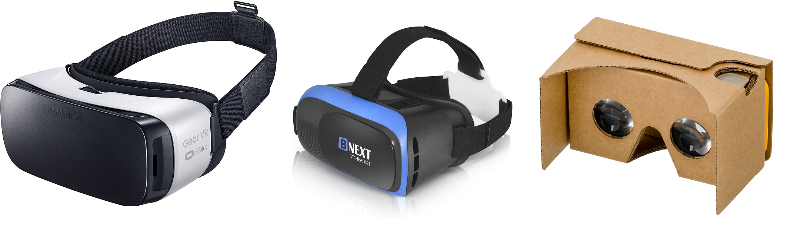
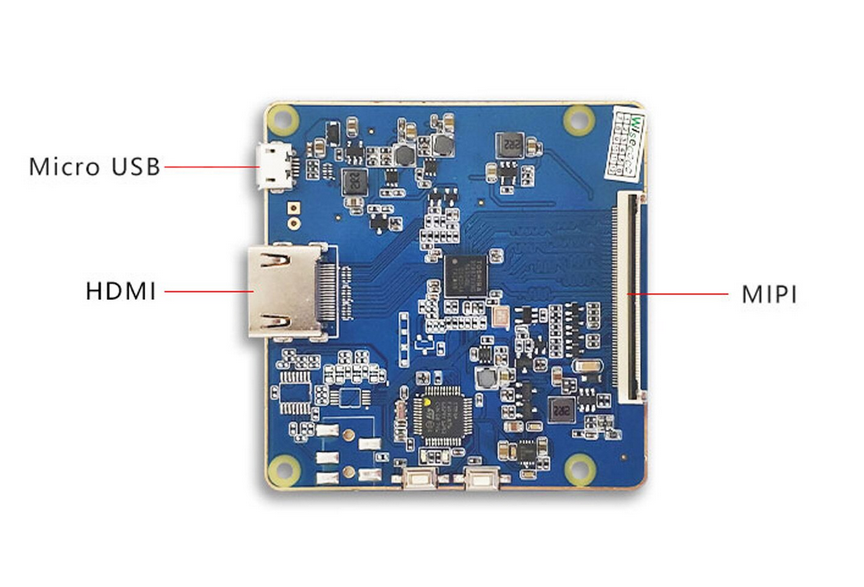
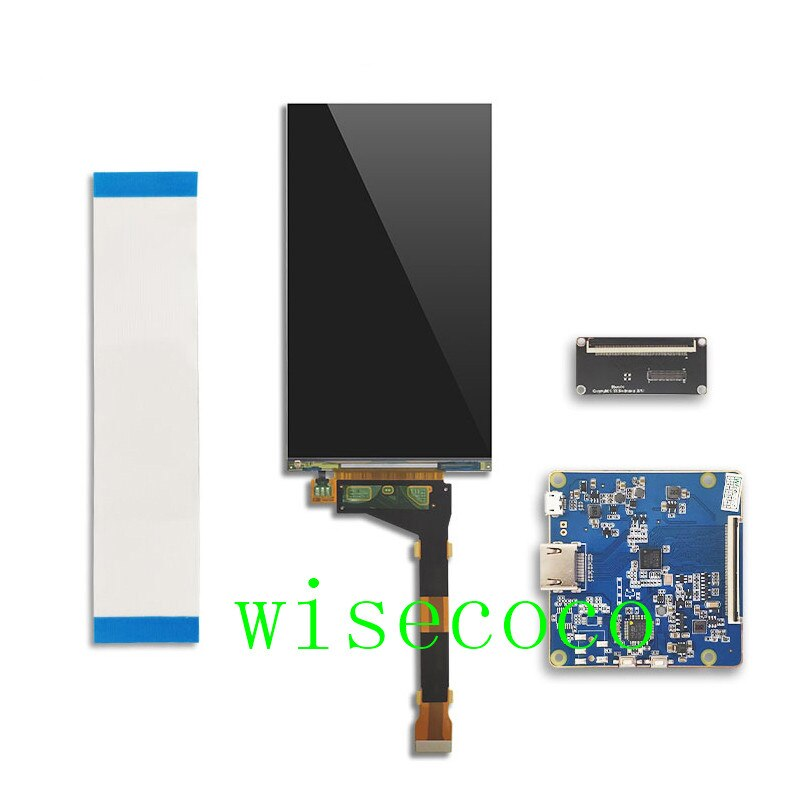
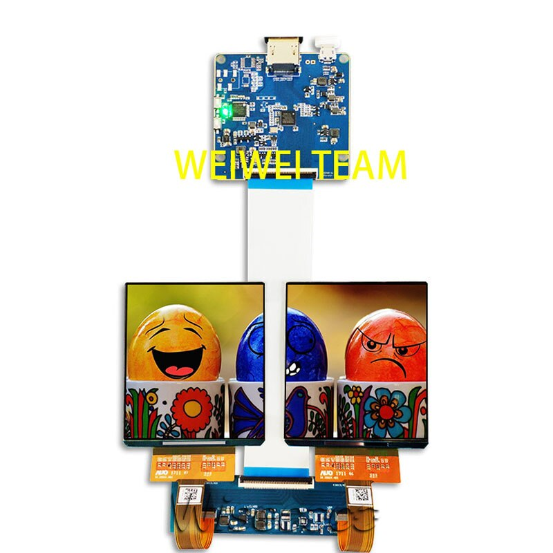
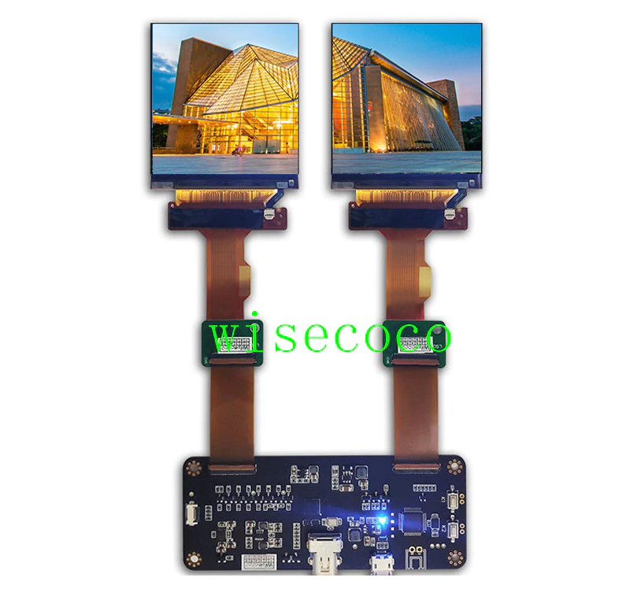
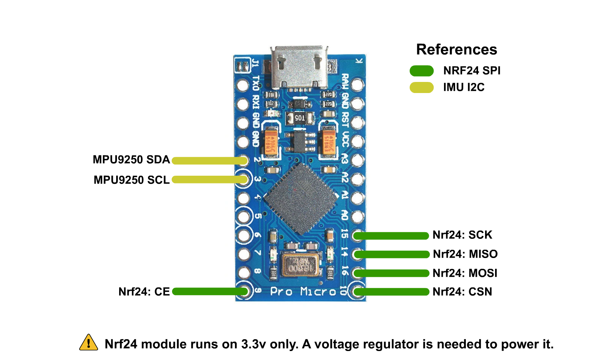
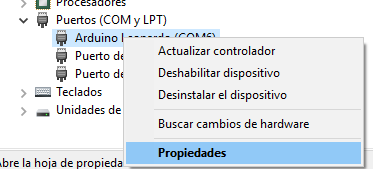

# Headset
The headset will not only be in charge of showing you the image and relaying back rotation data from it's internal IMU, but it will also be in charge of receiving the RF Controller data and sending it back to the computer. Another thing that can be integrated into the headset is an USB Sound Card, that way it'll also have an integrated Microphone and a headphone jack for you to plug your headphones in. Though it's not mandatory.

I plan on eventually making a custom pcb for the headset that includes a 2 port USB hub, an audio interface for headphones and microphone integration, an STM32 as the main microcontroller and maybe a couple other goodies like an attempt at backlight strobing to reduce screen blur.

# Hardware Needed

## Shell
For the shell you can use any "Phone VR" enclosure, they come in very different qualities but all of them should do the trick (even the carboard ones). Keep in mind the enclosure will dictate your max fov and that you can always modify the shell to allow for a wider fov.

You could also 3d print the shell, like the guys over at [Relativty](https://github.com/relativty/Relativty#building-the-mechanical-parts) did. Keep in mind you'll also need to source your own lenses with the correct focal length and head strap.

⚠️ The screen mount depends on what screen you use and you'll have to design your own sice not all mounts fit all headsets/screen combinations.

## Electronics

As the main microcontroller I suggest sticking to stuff that supports the [Arduino HID library](https://www.arduino.cc/en/Reference/HID). That means:

* Arduino Leonardo
* Arduino Pro micro
* Arduino DUE

An ideal candidate is the Arduino Pro Micro since it's based on the Atmega32u4 which is the microcontroller used on the Arduino Leonardo and it's fairly small.

Also needed are:
* An MPU9250 to gather rotation data (though you could use any IMU that's fast enough and can output rotation data to quaternions if you modify the code a bit to allow for that).

* An NRF24L01 to receive the controller data from both controllers*

* A 5v to 3.3v voltage regulator to power the NRF24 module*

* A High brightness LED that's a different colour from the ones used on the controllers (I suggest green) and a resistor for that LED for blob tracking (also needed is a white ping pong ball to put the LED into)**

    *: Only needed if you're also building the controllers.
    **: Only needed for 6dof tracking.

## Display(s)

There's a couple different displays you can use for this headset, anything from 4.5 to 6 inches should work just fine.
*As of right now*, using a phone with ALVR or RiftCat or whatever isn't supported though.

You can find these screens on Aliexpress, but make sure what you're getting is what you think you're getting. Ask the seller if the screen **AND** the driver board support the resolution and refresh rate they advertise.

Most of these screens come with a Blue driver board based around the [Toshiba TC358870XBG](https://toshiba.semicon-storage.com/ap-en/semiconductor/product/interface-bridge-ics-for-mobile-peripheral-devices/hdmir-interface-bridge-ics/detail.TC358870XBG.html), be skeptical of these boards since they support a huge multitude of displays at different refresh rates and resolutions, some sellers even claim they can drive two displays at 90hz.

There's a couple different versions of these blue driver boards, the most common one based around the TOSHIBA chip, the other one based on a clone of said chip.

Some screen options are:

### LS055R1SX04 or LS055R1SX03
These screens are 1440x2560(vertical), they officially support up to 60Hz but depending on the driver board they can be pushed to around 70 without artifacts (this depends on the driver board).

⚠️ Make sure you're getting the correct refresh rate since a lot of sellers sell these boards with a driver board that's programmed to run at only 50hz

These are reasonably cheap since they're commonly used in resin 3d printers and can be found for around 50USD.

You can find these boards by searching with the terms "5.5 LCD MIPI"

### Dual AMOLED H381DLN01
These screens are 1080x1200 per eye (2160x1200) and they claim to run at 90Hz.
They use the Blue driver board and the screens are 3.81 inches each and use AMOLED displays.

⚠️ Make sure you're getting the correct refresh rate before buying

⚠️ Make sure the driver splits the image into the two displays and doesn't just display the same image across both displays before buying.

These are a lot more expensive than the last one and can be found for around 170USD for the pair of screens + driver board
You can find these boards by searching with the terms "90Hz VR LCD"

### Dual LS029B3SX02
These screens are 1440x1440 per eye (2880x1440) and run at 120hz.
The use a different driver board that uses DisplayPort as a video input and the displays are 2.9 inch IPS LCD.

⚠️ Make sure you're getting the correct refresh rate before buying

These go for around 180USD for the pair of screens and driver board, making them a better purchase than the dual AMOLED if you're looking for high refresh rate.

You can find these boards by searching with the terms "120Hz VR LCD"

# Circuit schematic
Circuit pins for the Arduino pro micro are as follows:

## ⚠️ IMPORTANT: YOU NEED A 5V TO 3.3V REGULATOR TO POWER THE NRF24 MODULE, ***THE PRO MICRO DOES NOT SUPPLY 3.3V ON ANY OF ITS PINS*** 
# Uploading the firmware

To upload the firmware you will need to have the [RF24 Arduino Library](https://github.com/nRF24/RF24) installed in your [Arduino IDE](https://www.arduino.cc/en/software). 

You can download the required library using the Libraries manager from within the Arduino IDE. The rest of the used libaries are already included in the firmware folder.

The steps to upload the firmware are as follows:

* Open Headset.ino inside the Software/Firmware/Headset folder
* Select "Arduino Leonardo" as the board if you're using an Arduino Pro Micro
* Select the correct COM port for the board
* Press the Upload button, if all goes well, you can move to setting the correct COMPort.

# Getting HID values

To configure the driver you will need the VID and PID values from the board you're using. The easiest way of getting them is going to the Arduino IDE, clicking on tools and clicking on get board info with the HMD plugged in:

Do note these values are in HEX so to use them in the driver config file you'll need to convert them to decimal numbers.
to do that you can use websites like [Rapidtables](https://www.rapidtables.com/convert/number/hex-to-decimal.html), just input your VID and PID values one at a time and convert them to decimal numbers.

Once done, you'll get values like these and then all you have to do is load them up in your driver config file. For more details on driver configuration, check out the [driver configuration docs](Driver.md#driver-configuration)

