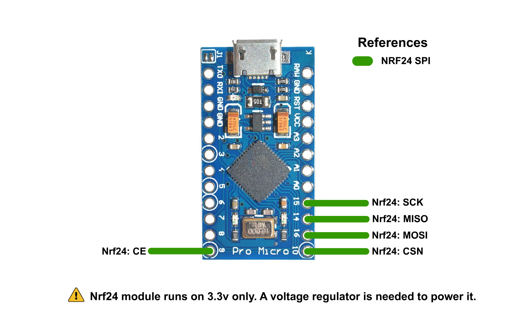

# RF Receiver

This is only needed if you already have an HMD and want to build only the controller part of the setup.

This RF receiver is in charge of receiving rotation and button data from the controllers, replacing the need for the HadesVR headset.

# Hardware Needed
I suggest sticking to stuff that supports the [Arduino HID library](https://www.arduino.cc/en/Reference/HID). An ideal candidate is the Arduino Pro Micro since it's based on the Atmega32u4 and it's fairly small.

Also needed are:
* An NRF24L01 to receive the controller data from both controllers
* A 5v to 3.3v voltage regulator to power the NRF24 module

# Circuit schematic
Circuit pins for the Arduino pro micro are as follows:

## ⚠️ IMPORTANT: YOU NEED A 5V TO 3.3V REGULATOR TO POWER THE NRF24 MODULE, ***THE PRO MICRO DOES NOT SUPPLY 3.3V ON ANY OF ITS PINS*** 

# Uploading the firmware

To upload the firmware you will need to have the [RF24 Arduino Library](https://github.com/nRF24/RF24) installed in your [Arduino IDE](https://www.arduino.cc/en/software). 

You can download the required library using the Libraries manager from within the Arduino IDE. The rest of the used libaries are already included in the firmware folder.

The steps to upload the firmware are as follows:

* Open Receiver.ino inside the Software/Firmware/Receiver folder
* Select "Arduino Leonardo" as the board if you're using an Arduino Pro Micro
* Select the correct COM port for the board
* Press the Upload button, if all goes well, you can move to setting the correct COMPort.

# Getting HID values

To configure the driver you will need the VID and PID values from the board you're using. The easiest way of getting them is going to the Arduino IDE, clicking on tools and clicking on get board info with the receiver plugged in:

Do note these values are in HEX so to use them in the driver config file you'll need to convert them to decimal numbers.
to do that you can use websites like [Rapidtables](https://www.rapidtables.com/convert/number/hex-to-decimal.html), just input your VID and PID values one at a time and convert them to decimal numbers.

Once done, you'll get values like these and then all you have to do is load them up in your driver config file. For more details on driver configuration, check out the [driver configuration docs](Driver.md#driver-configuration)

